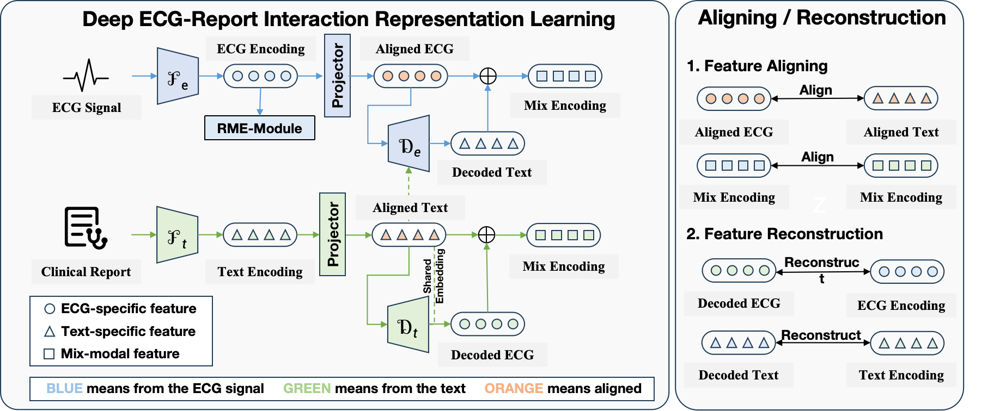

I am now a first-year fall P.hd student in HKU EEE, IoT lab supervised by Prof Edith C. H. Ngai. I attended Sun Yat-sen University, where I earned my Bachelor of Engineering (B.E.) and Master of Engineering (M.E.) degrees in Transportation Engineering from 2018 to 2022 and 2022 to 2025, respectively, under the supervision of Prof. Wei Wang.

My research interests include multi-modal learning, affective computing, AI for healthcare, and intelligent transportation systems (spatial-temporal data prediction). I always welcome the opportunity for research collaboration, and I'm eager to explore potential research ideas. My CV can be found here:[CV](../files/CV_chenjian_20250709.pdf).

If you're interested, please feel free to drop me an email (cccccj03@gmail.com).

## News 
**❗️❗️2025.07.07** One paper about Sticker Emotion Recognition inspired by the human ability to interpret sticker emotions from multiple views with MLLMs was accepted by **ACM MM 2025**!!

**❗️❗️2025.04.29** One paper about ECG-Report Representation Learning was accepted by **IJCAI 2025**!!

**❗️❗️2024.07.16** One paper about Sticker Emotion Recognition was accepted by **ACM MM 2024**!!

## Selected Publication

### AI for Healthcare

<table>
    <tr>
    <td width="50%">
      
    </td>
    <td>
      <strong>DERI</strong>: Cross-Modal ECG Representation Learning with Deep ECG-Report Interaction, <strong>IJCAI 2025</strong> (Oral)  
      👉 <a href="https://github.com/cccccj-03/DERI">[Code]</a> / <a href="https://ijcai-preprints.s3.us-west-1.amazonaws.com/2025/4530.pdf">[Paper]</a>(preprint)
    </td>
  </tr>
</table>

### Affective Computing

<table>
  <tr>
    <td width="50%">
      
    </td>
    <td>
      <strong>TGCA-PVT</strong>: Topic-Guided Context-Aware Pyramid Vision Transformer for Sticker Emotion Recognition, <strong>ACM MM 2024</strong> (Poster)  
      👉 <a href="https://github.com/cccccj-03/TGCA-PVT">[Code]</a> / <a href="https://dl.acm.org/doi/abs/10.1145/3664647.3680781">[Paper]</a>
    </td>
  </tr>
  <tr>
    <td width="50%">
      
    </td>
    <td>
      <strong>MGHFT</strong>: Multi-Granularity Hierarchical Fusion Transformer for Cross-Modal Sticker Emotion Recognition, <strong>ACM MM 2025</strong> (Oral)  
      👉 <a href="https://github.com/cccccj-03/MGHFT_ACMMM2025/tree/main">[Code]</a>/ <a href="https://arxiv.org/abs/2507.18929">[Paper]</a>
    </td>
  </tr>
</table>

